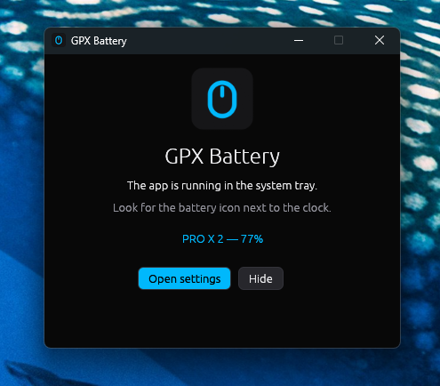
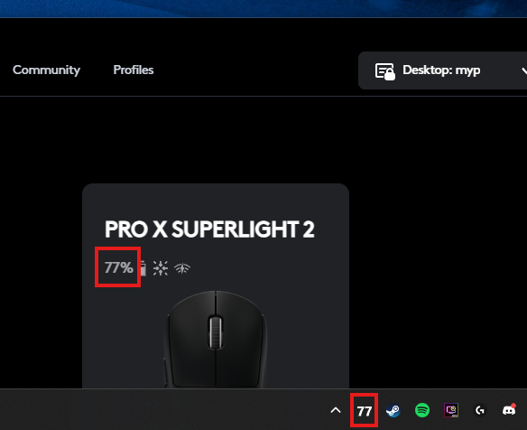
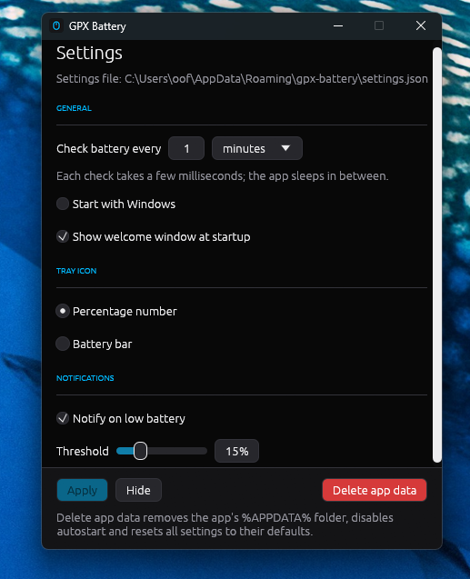

<p align="center">
   
</p>

# GPX Battery

A tiny, portable Windows tray app that shows the battery percentage of Logitech
wireless mice (built for the G Pro X Superlight 2, works with any HID++ 2.0
Logitech mouse). No G HUB required, no runtime dependencies — a single exe.

Made with performance in mind using **Rust**, the thread runs only when you want it to. 

# [⬇️ DOWNLOAD](https://github.com/AngeloCore/gpx-battery/releases)

<details>

<summary>👀 Preview</summary>





</details>

## How it works

1. **Discovery** — the app enumerates HID interfaces with Logitech's vendor id
   (`0x046D`) and the vendor-specific HID++ usage pages (`0xFF00`/`0xFF43`).
   Lightspeed/Unifying receivers are probed on all six pairing slots; mice
   connected over Bluetooth or USB cable answer directly. Mice that go offline
   (switched off) stay listed as "off" and reappear the moment they come back.
2. **Battery** — each mouse is queried over the HID++ 2.0 protocol: feature
   `0x1004` *Unified Battery* (Superlight 2), with fallbacks to `0x1000`
   *Battery Status* and `0x1001` *Battery Voltage* for older devices.
3. **Polling** — a background thread performs that few-millisecond exchange at
   the configured interval (default: every 60 s) and sleeps in between, so idle
   CPU usage is zero and there is no impact while gaming. Device plug/unplug
   triggers an immediate re-scan via `WM_DEVICECHANGE`.
4. **Tray** — one icon per selected mouse, drawn at runtime with GDI. White
   number normally, amber below 30 %, red below 15 %, green when charging,
   gray `?` when the mouse is off.

## Usage

Run `gpx-battery.exe`. A welcome window confirms the app is running and shows
the first detected mouse; the app then lives in the system tray.

- **Tray icon menu** (left or right click)
  - *Devices* — every detected wireless Logitech mouse with its current
    percentage; check/uncheck to show or hide its tray icon
  - *Refresh now* — re-scan and re-read immediately
  - *Settings…* — options window
  - *Exit*
- **Settings window** (dark, G HUB-style)
  - Poll interval: any value in seconds / minutes / hours
  - Start with Windows (HKCU `Run` registry entry)
  - Show welcome window at startup
  - Icon style: percentage number or battery bar
  - Low-battery notification with adjustable threshold
  - Changes take effect when you click **Apply**

## Settings storage

The app runs on built-in defaults and creates **no files** until you click
Apply, at which point `settings.json` is written to `%APPDATA%\gpx-battery`
(shown at the top of the settings window). The red
**Delete app data** button removes every file the app has created, disables
autostart and resets all settings to defaults. - Full cleanup.

## Building

```
cargo build --release
```

The exe icon, version info and DPI-awareness manifest are embedded by
`build.rs`; everything is statically linked.
